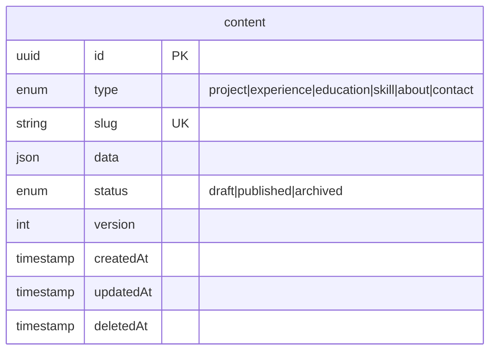

# Content Model Reference

This document defines the content types, schemas, and validation rules for the Portfolio CMS.

## Overview

All content is stored in a single `content` table with a flexible JSON `data` column. Content is categorized by `type` and identified by `slug`.



**Example data:**

| type | slug | data | status |
|------|------|------|--------|
| project | portfolio-backend | `{title, description, tags...}` | published |
| experience | work-history | `{items: [{company, role, startDate...}]}` | published |
| education | degrees | `{items: [{institution, degree...}]}` | published |
| skill | languages | `{items: [{name, category, proficiency...}]}` | published |
| about | about | `{title, content...}` | published |
| contact | contact | `{name, email, social...}` | published |

::: tip
Experience, education, and skill content types use a **list-based schema** with an `items` array. Each content item contains multiple entries (e.g., all work experiences in one content row).
:::

## Base Schema

All content items share these fields:

| Field | Type | Required | Description |
|-------|------|----------|-------------|
| `id` | UUID | Auto | Unique identifier |
| `type` | enum | Yes | `project`, `experience`, `education`, `skill`, `about`, `contact` |
| `slug` | string | Yes | URL-friendly identifier (unique per type) |
| `data` | JSON | Yes | Type-specific content (see below) |
| `status` | enum | Yes | `draft`, `published`, or `archived` |
| `version` | integer | Auto | Increments on each update |
| `sortOrder` | integer | No | Display order (default: 0) |
| `createdAt` | timestamp | Auto | Creation time |
| `updatedAt` | timestamp | Auto | Last update time |
| `deletedAt` | timestamp | Auto | Soft delete time (null if active) |

### Slug Rules

- Lowercase alphanumeric with hyphens only: `^[a-z0-9-]+$`
- Maximum 100 characters
- Unique within a `type`

## Content Types

### Project

Represents a portfolio project (app, website, library, etc.).

**Type**: `project`
**Slug**: Required (e.g., `portfolio-backend`, `task-manager`)

#### Schema

```typescript
interface ProjectData {
  title: string          // Required, 1-200 chars
  description: string    // Required, 1-500 chars (short summary)
  content?: string       // Optional, Markdown (full details)
  tags: string[]         // Default: []
  links?: {
    github?: string      // URL
    live?: string        // URL
    demo?: string        // URL
  }
  coverImage?: string    // URL
  featured: boolean      // Default: false
}
```

#### Example

```json
{
  "type": "project",
  "slug": "portfolio-backend",
  "status": "published",
  "sortOrder": 1,
  "data": {
    "title": "Portfolio Backend",
    "description": "A TypeScript/Express backend with CMS, AI chat, and MCP integration.",
    "content": "## Overview\n\nThis project demonstrates...",
    "tags": ["typescript", "express", "sqlite", "ai"],
    "links": {
      "github": "https://github.com/user/portfolio-backend",
      "live": "https://api.myportfolio.com"
    },
    "coverImage": "https://images.myportfolio.com/portfolio-backend.png",
    "featured": true
  }
}
```

### Experience

Work experience and employment history. Uses a **list-based schema** -- a single content item holds all experience entries in an `items` array.

**Type**: `experience`
**Slug**: Required (e.g., `work-history`)

#### Schema

```typescript
interface ExperienceData {
  items: Array<{
    company: string          // Required, max 200 chars
    role: string             // Required, max 200 chars
    description?: string     // Job description/achievements, max 2000 chars
    startDate: string        // Required, format: YYYY-MM
    endDate: string | null   // null = current position
    location?: string        // City, Country or "Remote", max 100 chars
    type?: 'full-time' | 'part-time' | 'contract' | 'freelance'
    skills: string[]         // Technologies used, default: []
  }>                         // Max 50 items
}
```

#### Example

```json
{
  "type": "experience",
  "slug": "work-history",
  "status": "published",
  "data": {
    "items": [
      {
        "company": "Tech Corp",
        "role": "Senior Software Engineer",
        "description": "Led development of microservices platform...",
        "startDate": "2022-06",
        "endDate": null,
        "location": "San Francisco, CA",
        "type": "full-time",
        "skills": ["TypeScript", "Kubernetes", "PostgreSQL"]
      }
    ]
  }
}
```

### Education

Educational background. Uses a **list-based schema** -- a single content item holds all education entries in an `items` array.

**Type**: `education`
**Slug**: Required (e.g., `degrees`)

#### Schema

```typescript
interface EducationData {
  items: Array<{
    institution: string      // Required, max 200 chars
    degree: string           // Required, max 200 chars (e.g., "B.S. Computer Science")
    field?: string           // Field of study, max 200 chars
    startDate: string        // Format: YYYY-MM
    endDate: string | null   // null = in progress
    location?: string        // Max 100 chars
    gpa?: string             // Optional (e.g., "3.8/4.0"), max 20 chars
    highlights?: string[]    // Achievements, activities, max 10 items
  }>                         // Max 20 items
}
```

### Skill

Skills grouped by category. Uses a **list-based schema** -- a single content item holds multiple skills in an `items` array.

**Type**: `skill`
**Slug**: Required (e.g., `languages`, `frameworks`)

#### Schema

```typescript
interface SkillData {
  items: Array<{
    name: string                                    // Required, max 100 chars
    category: 'language' | 'framework' | 'tool' | 'soft'  // Required
    icon?: string                                   // Icon name or URL, max 100 chars
    proficiency?: 1 | 2 | 3 | 4 | 5                // Skill level
  }>                                                // Max 100 items
}
```

#### Example

```json
{
  "type": "skill",
  "slug": "languages",
  "status": "published",
  "data": {
    "items": [
      {
        "name": "TypeScript",
        "category": "language",
        "icon": "typescript",
        "proficiency": 5
      },
      {
        "name": "Python",
        "category": "language",
        "icon": "python",
        "proficiency": 4
      }
    ]
  }
}
```

#### Category Definitions

| Category | Description | Examples |
|----------|-------------|----------|
| `language` | Programming languages | TypeScript, Python, Go |
| `framework` | Frameworks and libraries | React, Express, Django |
| `tool` | Development tools | Git, Docker, VS Code |
| `soft` | Soft skills | Communication, Leadership |

### About

About page content.

**Type**: `about`
**Slug**: Required (e.g., `about`)

#### Schema

```typescript
interface AboutData {
  title: string          // Required, 1-200 chars
  content: string        // Required, Markdown
  image?: string         // Optional, URL (hero image)
}
```

#### Example

```json
{
  "type": "about",
  "slug": "about",
  "status": "published",
  "data": {
    "title": "About Me",
    "content": "# Hello!\n\nI'm a software engineer based in...",
    "image": "https://images.myportfolio.com/headshot.jpg"
  }
}
```

### Contact

Contact information and social links.

**Type**: `contact`
**Slug**: Required (e.g., `contact`)

#### Schema

```typescript
interface ContactData {
  name: string              // Required, portfolio owner name
  title: string             // Required, job title/tagline
  email: string             // Required, contact email
  social: Record<string, string>  // Platform -> URL mapping
  chatEnabled: boolean      // Default: true
  chatSystemPrompt?: string // Custom system prompt for AI chat
}
```

#### Example

```json
{
  "type": "contact",
  "slug": "contact",
  "status": "published",
  "data": {
    "name": "Jane Developer",
    "title": "Full Stack Engineer",
    "email": "jane@example.com",
    "social": {
      "github": "https://github.com/janedev",
      "linkedin": "https://linkedin.com/in/janedev",
      "twitter": "https://twitter.com/janedev"
    },
    "chatEnabled": true
  }
}
```

## Content Bundle

The `/api/v1/content/bundle` endpoint returns all published content organized for frontend consumption:

```typescript
interface ContentBundle {
  projects: ContentWithData[]      // All published projects
  experiences: ContentWithData[]   // All published experience entries
  education: ContentWithData[]     // All published education entries
  skills: ContentWithData[]        // All published skill entries
  about: ContentWithData | null    // About page content (singleton)
  contact: ContentWithData | null  // Contact info (singleton)
}
```

## Versioning

Every content update creates a history record:

| Field | Description |
|-------|-------------|
| `contentId` | Reference to content item |
| `version` | Version number at time of snapshot |
| `data` | Complete data JSON at that version |
| `changeType` | `created`, `updated`, `deleted`, `restored` |
| `changedBy` | Identifier of who made the change |
| `changeSummary` | Auto-generated description of changes |
| `createdAt` | When this version was created |

### Version Operations

**Get history:**
```
GET /api/v1/admin/content/:id/history
```

**Restore version:**
```
POST /api/v1/admin/content/:id/restore
Body: { "version": 3 }
```

## Validation Summary

| Type | Schema Style | Required Fields | Optional Fields |
|------|-------------|-----------------|-----------------|
| `project` | Flat object | title, description | content, tags, links, coverImage, featured |
| `experience` | `items` array | items[].company, items[].role, items[].startDate | items[].description, items[].endDate, items[].location, items[].type, items[].skills |
| `education` | `items` array | items[].institution, items[].degree, items[].startDate | items[].field, items[].endDate, items[].location, items[].gpa, items[].highlights |
| `skill` | `items` array | items[].name, items[].category | items[].icon, items[].proficiency |
| `about` | Flat object | title, content | image |
| `contact` | Flat object | name, title, email, social | chatEnabled, chatSystemPrompt |

## Best Practices

### Content Organization

1. **Use meaningful slugs**: `portfolio-backend` not `project-1`
2. **Set sortOrder**: Control display order explicitly
3. **Keep descriptions concise**: Full content goes in `content` field
4. **Tag consistently**: Use lowercase, hyphenated tags

### Markdown Content

- Use standard Markdown (CommonMark)
- Images should be absolute URLs
- Code blocks with language hints: ` ```typescript `
- Keep headings hierarchical (don't skip levels)
