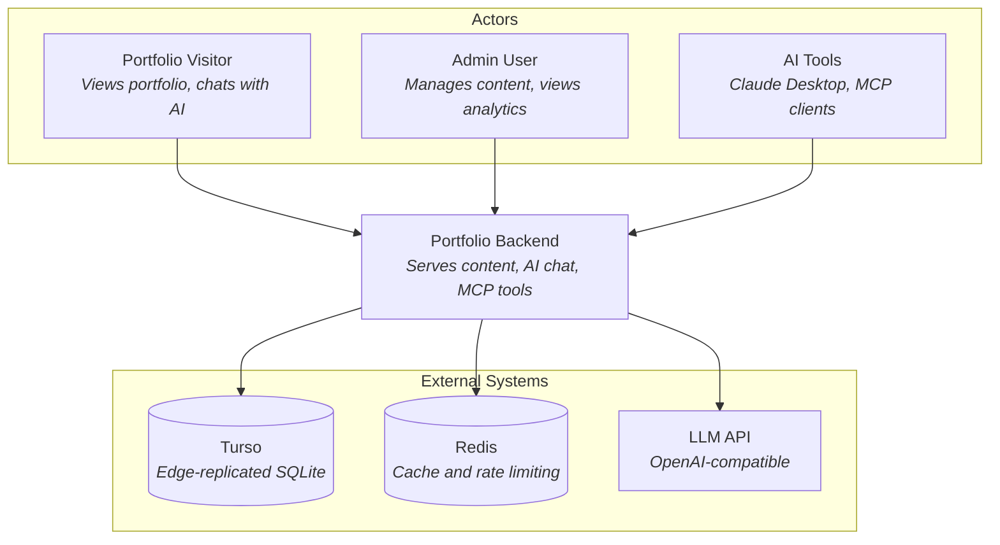
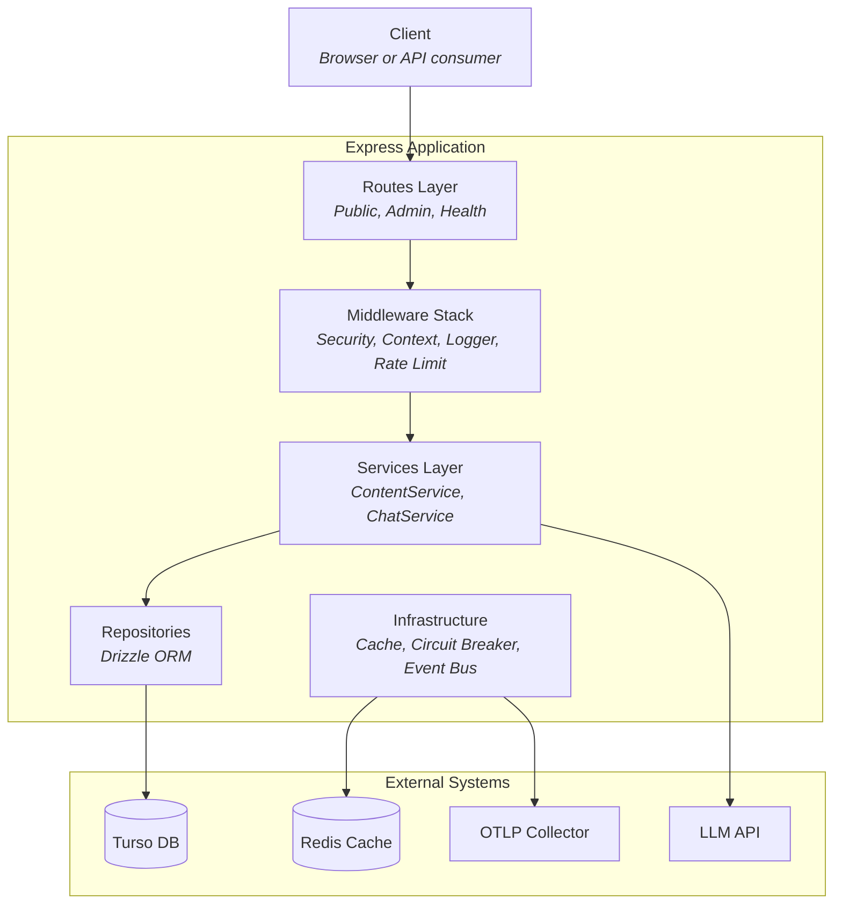
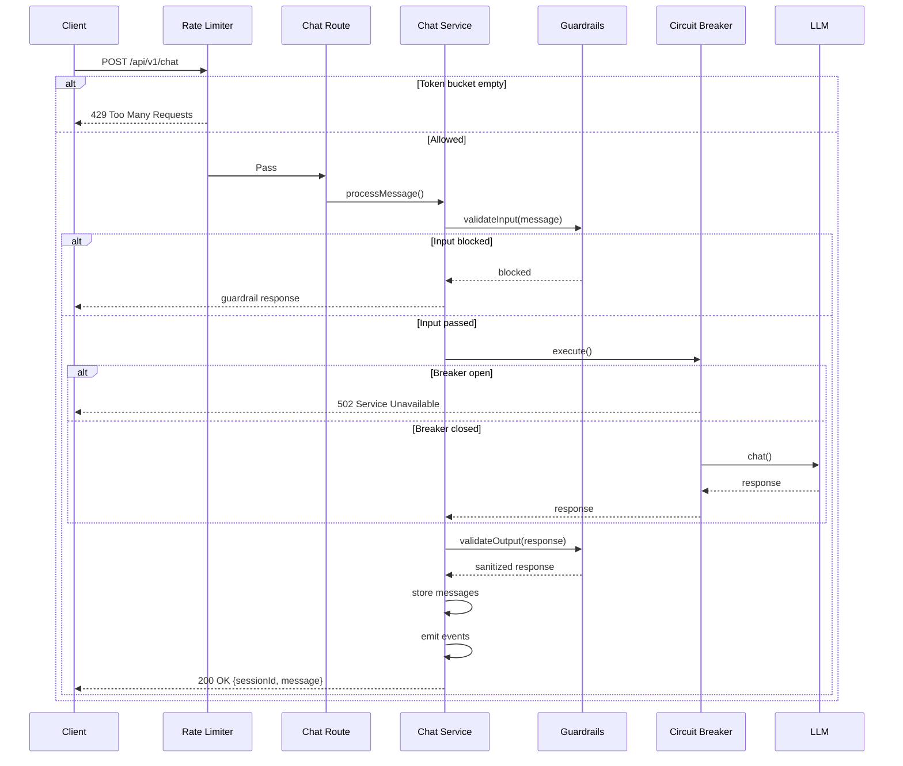

# High-Level Design (HLD)

**Version**: 1.0.0
**Last Updated**: 2025-01-25
**Status**: Approved

## Executive Summary

### Purpose

A TypeScript/Express backend serving a personal portfolio website with:
- Content Management System (CMS) for portfolio content
- AI-powered chat for visitor engagement
- MCP (Model Context Protocol) server for AI tooling integration

### Goals

1. **Showcase Backend Skills**: Demonstrate proficiency in modern backend patterns
2. **Production-Ready**: Deployable with proper observability, security, and resilience
3. **Maintainable**: Clean architecture with clear separation of concerns
4. **Extensible**: Easy to add new features without major refactoring

### Scope

| In Scope | Out of Scope |
|----------|--------------|
| REST API for content and chat | User authentication (admin-only API key) |
| AI chat with rate limiting | Multi-tenant support |
| MCP server integration | Real-time features (WebSocket) |
| Content versioning | Media file storage |
| Observability (logs, metrics, traces) | Full-text search engine |

## System Context

### C4 Level 1: System Context Diagram



### External Systems

| System | Purpose | Protocol | Notes |
|--------|---------|----------|-------|
| **Turso** | Primary database (libSQL/SQLite) | HTTPS | Edge-replicated SQLite |
| **Redis** | Caching, rate limiting state | TCP | Optional, falls back to memory |
| **LLM Provider** | AI chat responses | HTTPS | OpenAI-compatible API |
| **OTLP Collector** | Trace collection | HTTPS | Optional, for observability |

### Actors

| Actor | Description | Interaction |
|-------|-------------|-------------|
| **Portfolio Visitor** | Anonymous users viewing the portfolio | Read content, use chat |
| **Admin** | Portfolio owner managing content | CRUD operations via API key |
| **AI Tools** | Claude Desktop, other MCP clients | Query portfolio via MCP protocol |

## Container Architecture

### C4 Level 2: Container Diagram



### Container Responsibilities

| Container | Technology | Responsibility |
|-----------|------------|----------------|
| **Express App** | Express.js | HTTP API, routing, middleware |
| **Services** | TypeScript | Business logic, orchestration |
| **Repositories** | Drizzle ORM | Data access abstraction |
| **Infrastructure** | Various | Cross-cutting concerns |
| **MCP Server** | MCP SDK | AI tool integration |

::: tip
For detailed rationale on architectural decisions, see the [Architecture Decision Records](/decisions/).
:::

## Data Flow

### Content Read Flow


### Chat Message Flow



### Chat Message Flow with Tools

The chat service uses OpenAI function calling to query portfolio data:


**Key components:**

| Component | Description |
|-----------|-------------|
| `chatToolDefinitions` | OpenAI function schemas for list_content, get_content, search_content |
| `executeToolCall()` | Executes tool calls and returns JSON results |
| Tool loop | Up to 5 iterations until LLM has enough context |
| Core tools | Shared implementation with MCP server (see [ADR-008](/decisions/008-shared-tools-architecture)) |

## Non-Functional Requirements

### Performance

| Metric | Target | Measurement |
|--------|--------|-------------|
| API Response Time (p95) | < 200ms | Prometheus histogram |
| API Response Time (p99) | < 500ms | Prometheus histogram |
| Chat Response Time (p95) | < 5s | Prometheus histogram |
| Content Bundle Load | < 100ms | Prometheus histogram |
| Throughput | 100 req/s | Load testing |

### Availability

| Metric | Target | Strategy |
|--------|--------|----------|
| Uptime | 99.9% | Health checks, graceful degradation |
| Recovery Time | < 30s | Container restart, circuit breaker |
| Data Durability | 99.99% | Turso replication |

### Scalability

| Dimension | Current | Path to Scale |
|-----------|---------|---------------|
| Concurrent Users | 10-50 | Single instance sufficient |
| Content Items | 1000s | SQLite handles well |
| Chat Sessions | 100s/day | Rate limiting protects resources |
| Horizontal Scale | N/A | Redis enables multi-instance |

### Security

| Concern | Mitigation |
|---------|------------|
| API Authentication | API key for admin routes |
| Input Validation | Zod schemas, sanitization |
| Rate Limiting | Token bucket per IP |
| Data Privacy | PII detection and sanitization in LLM responses |
| Transport | HTTPS only in production |
| Headers | Helmet security headers |

## Security Architecture

### Authentication & Authorization


### Data Protection

| Data Type | Protection | Storage |
|-----------|------------|---------|
| Admin API Key | Environment variable | Never logged |
| User Messages | Stored as-is, output sanitized | PII redacted from LLM responses |
| IP Addresses | Hashed (SHA-256) | Logs, rate limit keys |
| Visitor IDs | Client-generated | Session tracking only |

## Deployment Architecture

### Container Deployment


### Health Checks

| Probe | Endpoint | Purpose | Interval |
|-------|----------|---------|----------|
| Liveness | `/api/health/live` | Is process alive? | 30s |
| Readiness | `/api/health/ready` | Can accept traffic? | 10s |
| Startup | `/api/health/startup` | Has initialization completed? | 5s |
| Metrics | `/api/metrics` | Prometheus scrape (requires `X-Admin-Key`) | 15s |

### Background Jobs

| Job | Schedule | Description |
|-----|----------|-------------|
| Session cleanup | Hourly | Expires inactive chat sessions and updates their status |

## Monitoring & Observability

### Three Pillars


### Key Metrics

| Category | Metric | Labels | Alert Threshold |
|----------|--------|--------|-----------------|
| HTTP | `http_requests_total` | method, path, status | - |
| HTTP | `http_request_duration_seconds` | method, path, status | p99 > 1s |
| HTTP | `http_errors_total` | status, code | > 10/min |
| Chat | `chat_messages_total` | role | - |
| Chat | `chat_tokens_total` | type | > 10k/hour |
| LLM | `llm_requests_total` | provider, status | errors > 5/min |
| LLM | `llm_request_duration_seconds` | provider | p95 > 10s |
| Circuit | `circuit_breaker_state` | name | state = 2 (open) |
| Rate | `rate_limit_hits_total` | - | > 100/hour |
| Cache | `cache_hits_total` | key_prefix | - |
| Cache | `cache_misses_total` | key_prefix | ratio < 0.5 |

### Log Structure

```json
{
  "level": "info",
  "time": 1706184000000,
  "context": "http",
  "requestId": "550e8400-e29b-41d4-a716-446655440000",
  "traceId": "abc123...",
  "method": "POST",
  "path": "/api/v1/chat",
  "statusCode": 200,
  "duration": 1523,
  "ip": "sha256:...",
  "userAgent": "Mozilla/5.0..."
}
```

## Appendix

### Glossary

| Term | Definition |
|------|------------|
| **ADR** | Architecture Decision Record |
| **Circuit Breaker** | Pattern to prevent cascading failures |
| **CQRS** | Command Query Responsibility Segregation |
| **LLM** | Large Language Model |
| **MCP** | Model Context Protocol |
| **OTLP** | OpenTelemetry Protocol |
| **PII** | Personally Identifiable Information |
| **Token Bucket** | Rate limiting algorithm |

### References

- [C4 Model](https://c4model.com/)
- [OpenTelemetry](https://opentelemetry.io/)
- [Model Context Protocol](https://modelcontextprotocol.io/)
- [Turso Documentation](https://docs.turso.tech/)
