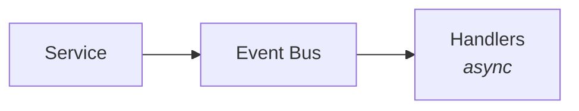
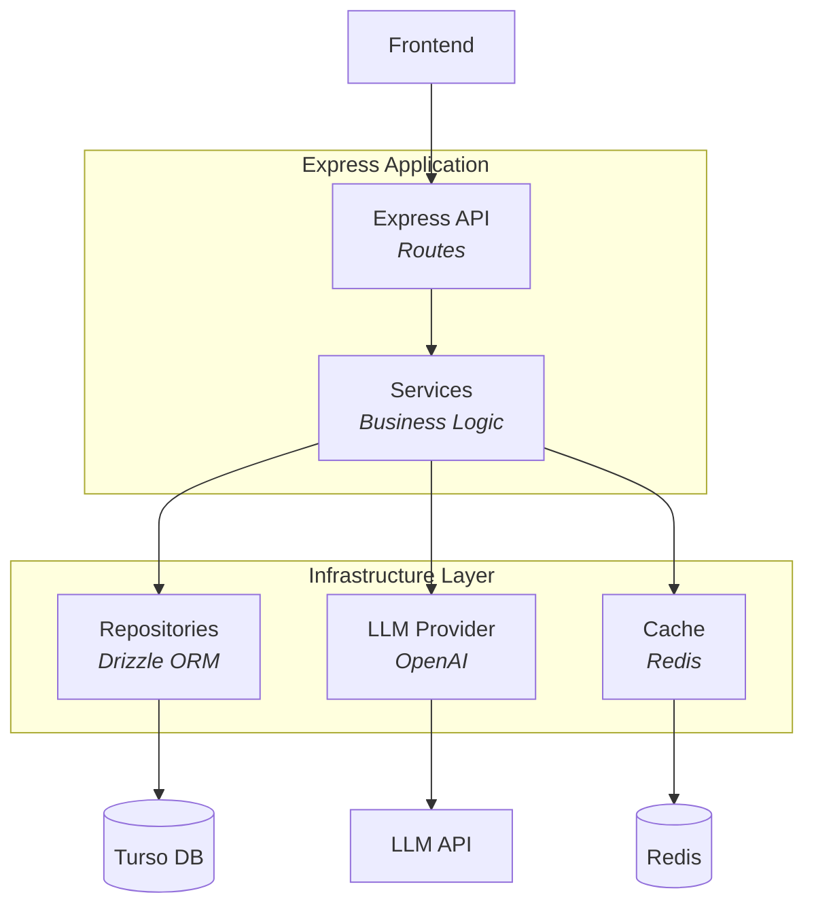

# Architecture Overview

The Portfolio Backend follows a layered architecture with clear separation of concerns. This section covers the system design at various levels of detail.

## Documentation Structure

| Document | Description |
|----------|-------------|
| [High-Level Design](/architecture/high-level-design) | System context, containers, deployment |
| [Low-Level Design](/architecture/low-level-design) | Components, classes, sequences |
| [Content Model](/architecture/content-model) | Data schemas and validation |

## Design Principles

### 1. Clean Architecture

The codebase follows clean architecture principles:

- **Routes** - HTTP handling, request/response transformation
- **Services** - Business logic, orchestration
- **Repositories** - Data access abstraction
- **Infrastructure** - Cross-cutting concerns (cache, events, metrics)

### 2. Dependency Injection

All dependencies are injected, enabling:

- Easy unit testing with mocks
- Flexible configuration
- Clear dependency graphs

### 3. Event-Driven Side Effects

Side effects (cache invalidation, metrics, audit logs) are decoupled via events:

This keeps core logic focused and testable.

## System Overview

## Key Components

### Content Management

- Single `content` table with flexible JSON `data` column
- Type-specific validation via Zod schemas
- Version history tracking with restore capability
- Soft deletes for safety

### Chat System

- Session-based conversations
- PII obfuscation before LLM calls
- Token bucket rate limiting
- Circuit breaker for resilience

### MCP Server

- Tools for CRUD operations
- Resources for reading content
- Prompts for common use cases
- Shared data layer with REST API

## Architecture Decision Records

Key decisions are documented as ADRs:

| ADR | Decision |
|-----|----------|
| [001](/decisions/001-database-choice) | Turso (libSQL) for database |
| [002](/decisions/002-caching-strategy) | Layered caching with Redis |
| [003](/decisions/003-llm-abstraction) | Provider abstraction layer |
| [004](/decisions/004-repository-pattern) | Repository pattern for data access |
| [005](/decisions/005-observability) | Events and OpenTelemetry tracing |
| [006](/decisions/006-pii-obfuscation) | Token-based PII protection |
| [007](/decisions/007-content-model-flexibility) | Flexible content model |
