# Low-Level Design (LLD)

**Version**: 1.0.0
**Last Updated**: 2025-01-25
**Status**: Approved

## Component Design

### C4 Level 3: Component Diagram

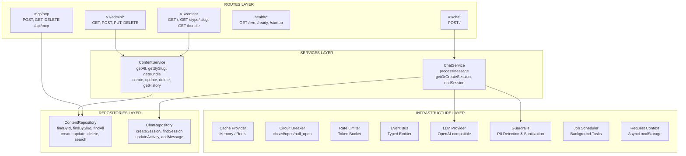

### Shared Tools Layer

The tools layer provides unified tool implementations used by both MCP and Chat:

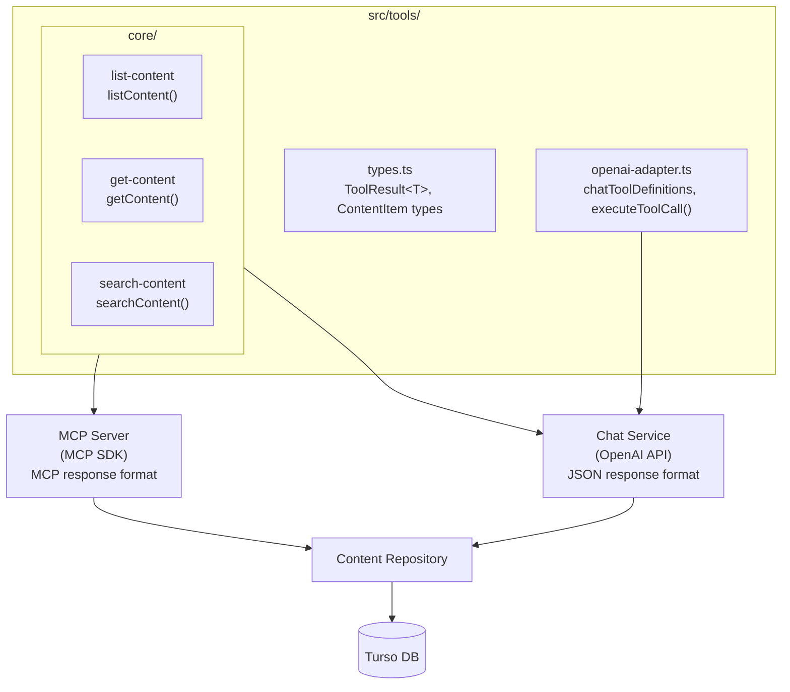

**Key components:**

| File | Purpose |
|------|---------|
| `types.ts` | Shared types: `ToolResult<T>`, `ContentItem`, result types |
| `core/list-content.ts` | `listContent()` - List content by type with filters |
| `core/get-content.ts` | `getContent()` - Get single item by type and slug |
| `core/search-content.ts` | `searchContent()` - Search content by keywords |
| `openai-adapter.ts` | `chatToolDefinitions` (JSON Schema), `executeToolCall()` |

**Schema conversion:**

```typescript
// Zod schema in src/mcp/types.ts
export const ListContentInputSchema = z.object({
  type: z.enum(['project', 'experience', 'education', 'skill', 'about', 'contact']),
  status: z.enum(['draft', 'published', 'archived']).default('published'),
  limit: z.number().int().min(1).max(100).default(50),
})

// Converted to JSON Schema for OpenAI via zod-to-json-schema
import { zodToJsonSchema } from 'zod-to-json-schema'
const jsonSchema = zodToJsonSchema(ListContentInputSchema)
```

## Class Diagrams

### Repository Interfaces

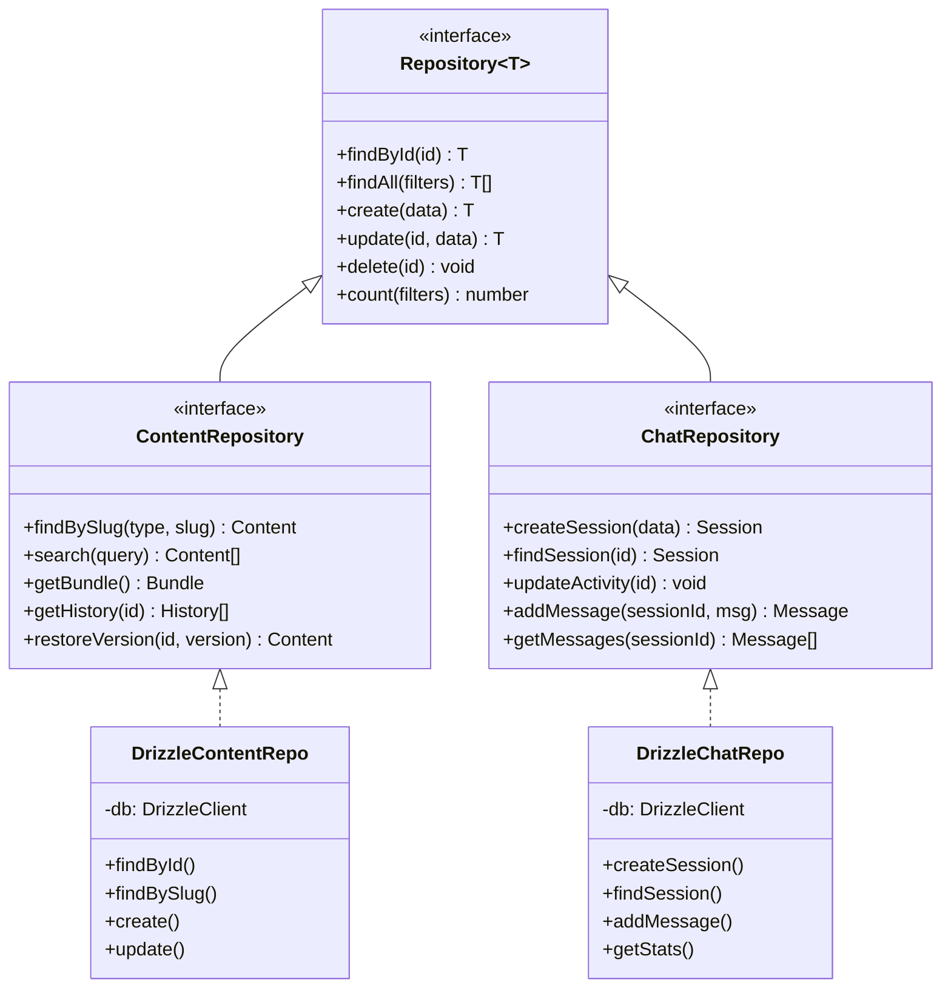

### Cache Provider Pattern

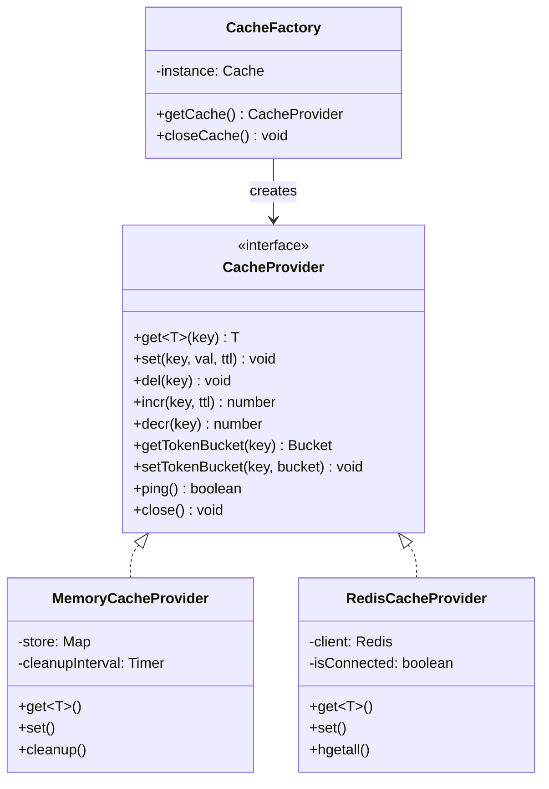

### Error Class Hierarchy

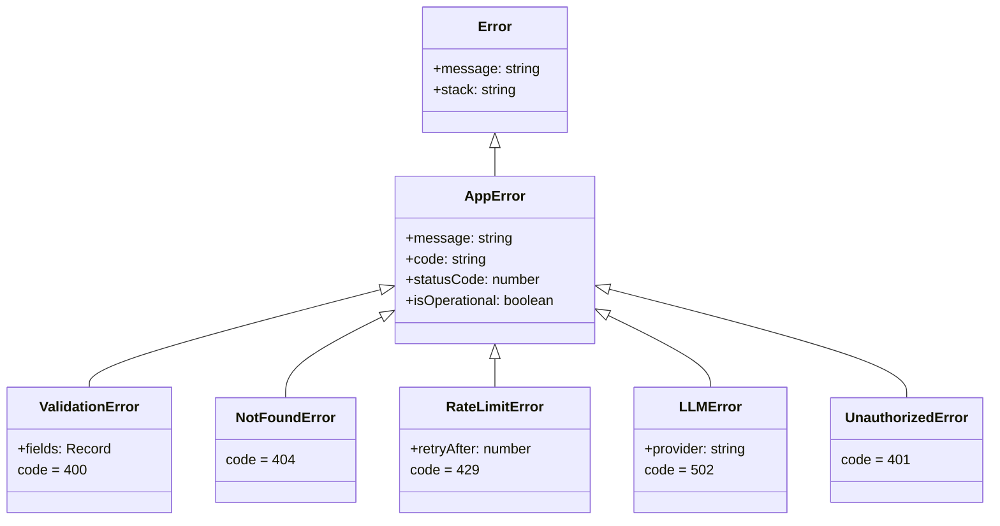

### Event System

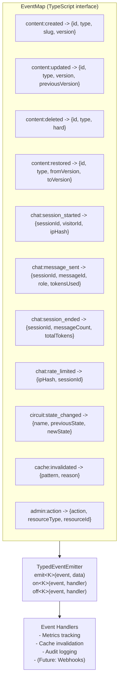

## Database Design

### Entity Relationship Diagram

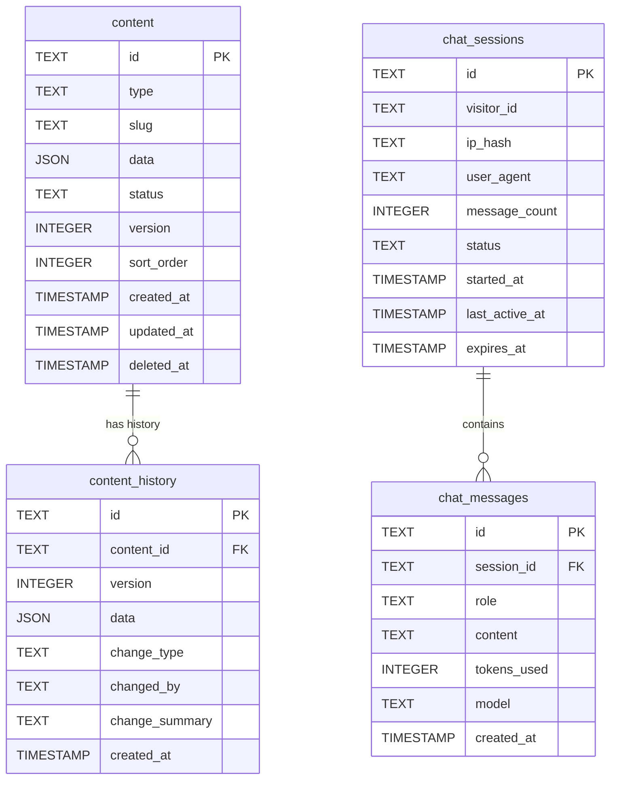

## Sequence Diagrams

### Content Bundle Request (Cache Hit)

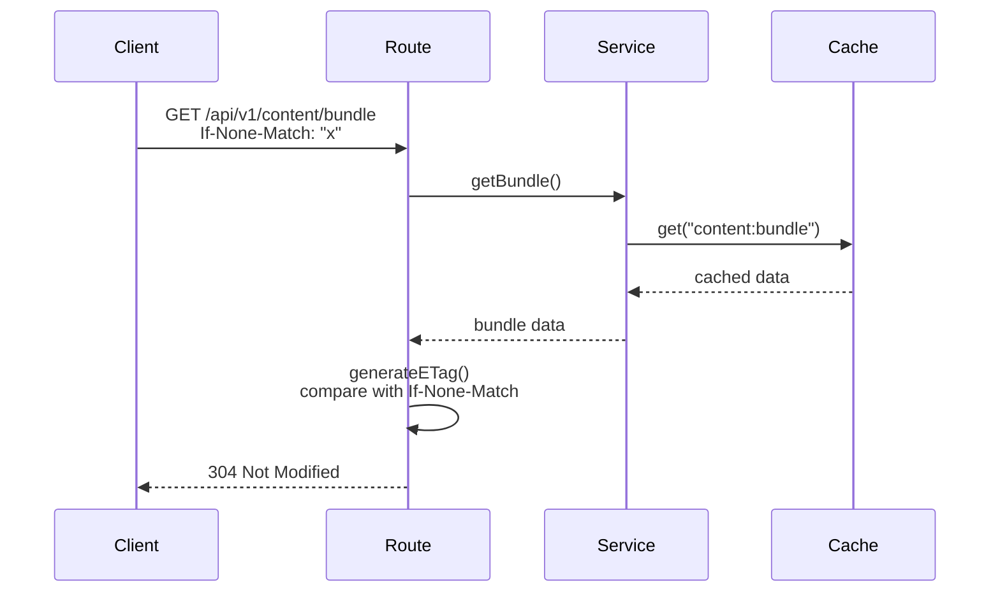

### Chat Message Flow (Full)

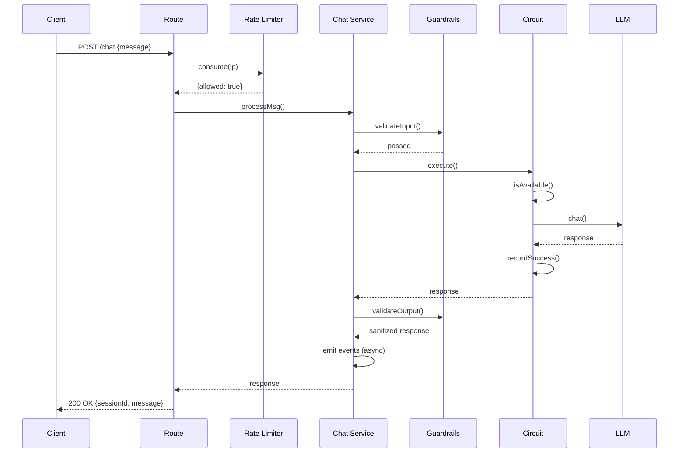

### Content Versioning Transaction Flow

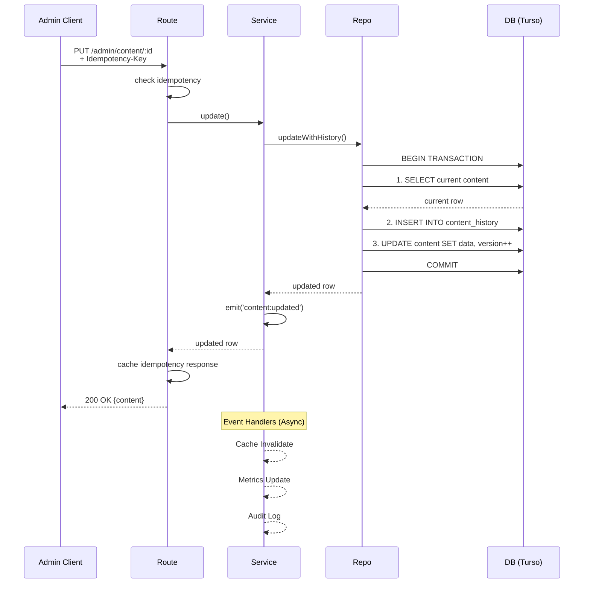

**Transaction Details:**

```typescript
// src/repositories/content.repository.ts
async updateWithHistory(
  id: string,
  updates: Partial<ContentUpdate>,
  changedBy?: string
): Promise<Content> {
  return this.db.transaction(async (tx) => {
    // 1. Read current state
    const [current] = await tx
      .select()
      .from(content)
      .where(eq(content.id, id))

    if (!current) {
      throw new NotFoundError('Content', id)
    }

    // 2. Archive current version to history
    await tx.insert(contentHistory).values({
      id: generateId(),
      contentId: id,
      version: current.version,
      data: current.data,
      changeType: 'update',
      changedBy,
      changeSummary: this.summarizeChanges(current.data, updates.data),
      createdAt: new Date(),
    })

    // 3. Update content with new version
    const [updated] = await tx
      .update(content)
      .set({
        ...updates,
        version: current.version + 1,
        updatedAt: new Date(),
      })
      .where(eq(content.id, id))
      .returning()

    return updated
  })
}
```

### Content Restore Flow

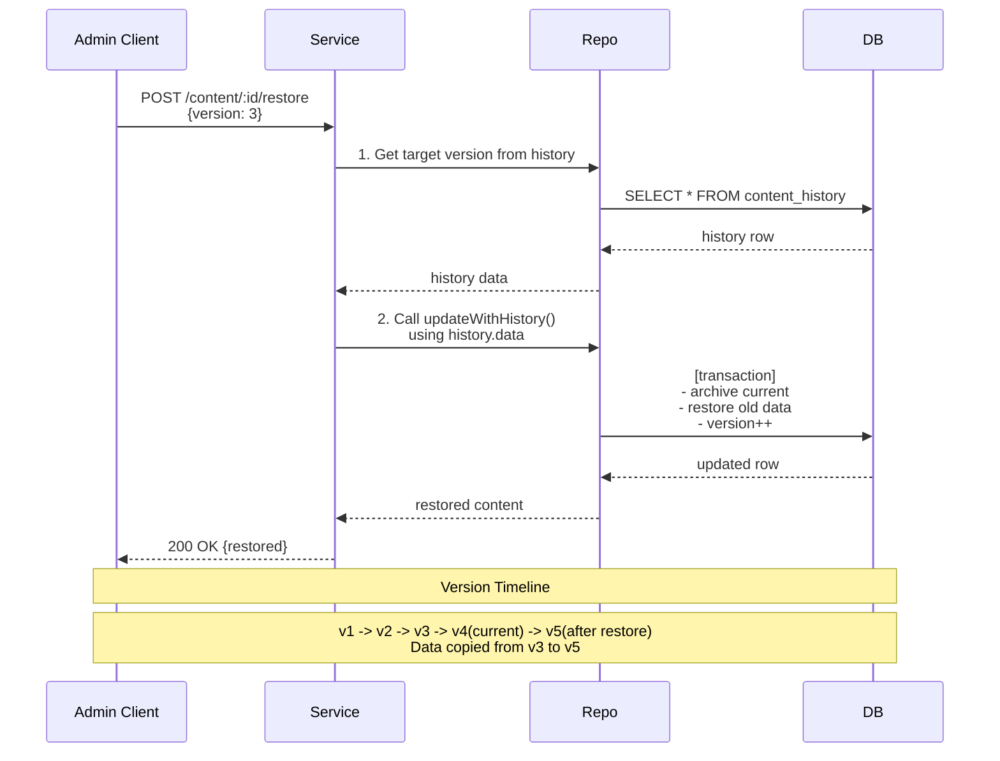

### Circuit Breaker State Transitions

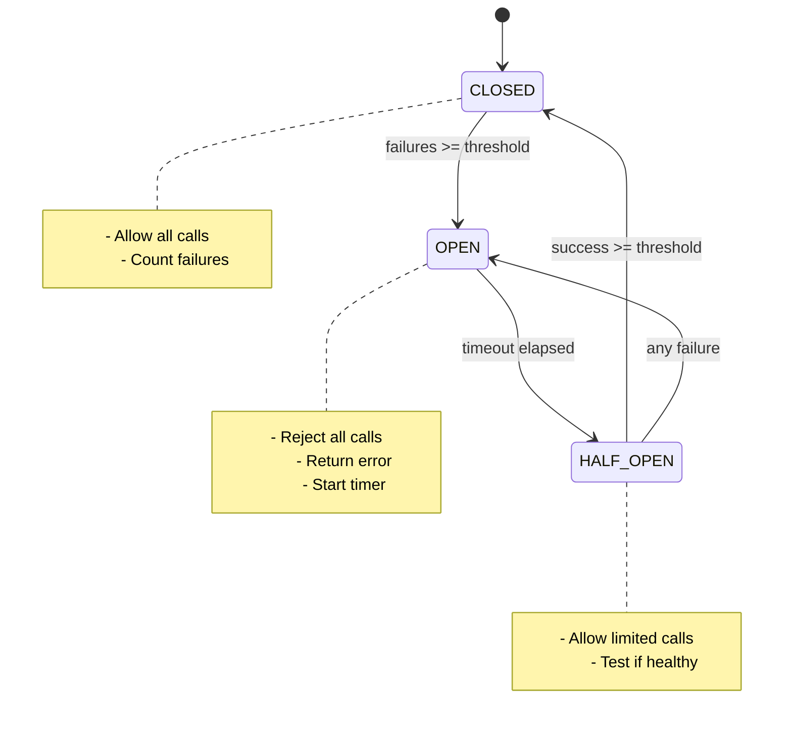

**Configuration:**
- `failureThreshold`: 5 (failures before opening)
- `resetTimeout`: 30000ms (time before trying half-open)
- `halfOpenMaxAttempts`: 2 (successes needed to close)

## Error Handling

### Error Response Format

```typescript
interface ErrorResponse {
  error: string           // Human-readable message
  code: string            // Machine-readable code
  requestId: string       // For tracing
  fields?: Record<string, string[]>  // Validation errors
  retryAfter?: number     // For rate limiting
  stack?: string          // Dev mode only
}
```

### HTTP Status Code Mapping

| Status | Code | Scenario |
|--------|------|----------|
| 400 | VALIDATION_ERROR | Invalid request body/params |
| 401 | UNAUTHORIZED | Missing/invalid admin key |
| 404 | NOT_FOUND | Resource doesn't exist |
| 409 | CONFLICT | Duplicate slug |
| 429 | RATE_LIMITED | Token bucket empty |
| 500 | INTERNAL_ERROR | Unexpected server error |
| 502 | LLM_ERROR | LLM provider failure |

### Error Class Implementation

```typescript
// src/errors/app-error.ts
export class AppError extends Error {
  constructor(
    message: string,
    public readonly code: string,
    public readonly statusCode: number,
    public readonly isOperational: boolean = true,
    public readonly details?: Record<string, unknown>
  ) {
    super(message)
    this.name = this.constructor.name
    Error.captureStackTrace(this, this.constructor)
  }
}

// Specialized error classes
export class ValidationError extends AppError {
  constructor(
    message: string,
    public readonly fields: Record<string, string[]>
  ) {
    super(message, 'VALIDATION_ERROR', 400, true, { fields })
  }
}

export class NotFoundError extends AppError {
  constructor(resource: string, identifier: string) {
    super(
      `${resource} not found: ${identifier}`,
      'NOT_FOUND',
      404
    )
  }
}

export class UnauthorizedError extends AppError {
  constructor(message = 'Invalid or missing authentication') {
    super(message, 'UNAUTHORIZED', 401)
  }
}

export class RateLimitError extends AppError {
  constructor(public readonly retryAfter: number) {
    super(
      'Rate limit exceeded',
      'RATE_LIMITED',
      429,
      true,
      { retryAfter }
    )
  }
}

export class ConflictError extends AppError {
  constructor(message: string, field?: string) {
    super(message, 'CONFLICT', 409, true, field ? { field } : undefined)
  }
}

export class LLMError extends AppError {
  constructor(
    message: string,
    public readonly provider: string,
    public readonly originalError?: Error
  ) {
    super(message, 'LLM_ERROR', 502, true, { provider })
  }
}
```

### Throwing Errors in Services

```typescript
// src/services/content.service.ts
export class ContentService {
  async getBySlug(type: string, slug: string): Promise<Content> {
    const content = await this.repository.findBySlug(type, slug)

    if (!content) {
      throw new NotFoundError('Content', `${type}/${slug}`)
    }

    if (content.status !== 'published') {
      throw new NotFoundError('Content', `${type}/${slug}`)
    }

    return content
  }

  async create(data: CreateContentInput): Promise<Content> {
    // Check for duplicate slug
    if (data.slug) {
      const existing = await this.repository.findBySlug(data.type, data.slug)
      if (existing) {
        throw new ConflictError(
          `Content with slug '${data.slug}' already exists`,
          'slug'
        )
      }
    }

    return this.repository.create(data)
  }
}

// src/services/chat.service.ts
export class ChatService {
  async processMessage(input: ChatInput): Promise<ChatResponse> {
    // Rate limit check happens in middleware, but we double-check here
    const allowed = await this.rateLimiter.consume(input.ipHash, 1)
    if (!allowed.allowed) {
      throw new RateLimitError(allowed.retryAfter)
    }

    try {
      const response = await this.circuitBreaker.execute(() =>
        this.llmProvider.chat(messages, options)
      )
      return response
    } catch (error) {
      if (error instanceof CircuitBreakerOpenError) {
        throw new LLMError(
          'AI service temporarily unavailable',
          this.llmProvider.name
        )
      }
      throw error
    }
  }
}
```

See [API Reference - Error Codes](/api/reference#error-codes) for error response examples and the full status code mapping.

## Testing Strategy

### Test Pyramid

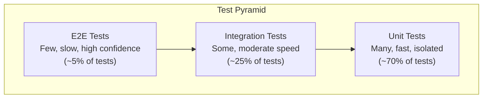

### Coverage Targets

| Metric | Target | Rationale |
|--------|--------|-----------|
| Line Coverage | 80% | Balance between confidence and maintenance |
| Branch Coverage | 75% | Ensure error paths are tested |
| Critical Paths | 100% | Auth, rate limiting, data mutations |
| Infrastructure | 60% | Harder to test, rely on integration tests |

### Test Categories

| Category | Directory | Focus | Tools |
|----------|-----------|-------|-------|
| Unit | `tests/unit/` | Functions, classes in isolation | Jest (ts-jest ESM), mocks |
| Integration | `tests/integration/` | API endpoints, DB operations | Supertest, in-memory SQLite |
| E2E | `tests/e2e/` | Full HTTP and MCP flows | Supertest, in-memory SQLite |

### Database Testing Strategy

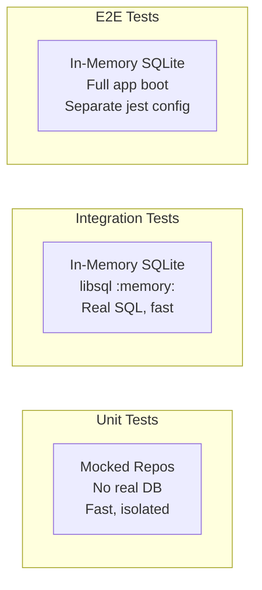

> See `tests/` directory for implementation examples including mocks, fixtures, and test utilities.

## Appendix

### File Naming Conventions

Files use dot-separated naming to indicate their layer:

| Type | Pattern | Example |
|------|---------|---------|
| Routes | `{resource}.routes.ts` | `content.routes.ts`, `chat.routes.ts` |
| Services | `{name}.service.ts` | `chat.service.ts`, `content.service.ts` |
| Repositories | `{entity}.repository.ts` | `content.repository.ts`, `chat.repository.ts` |
| Middleware | `{name}.middleware.ts` | `admin-auth.middleware.ts`, `idempotency.middleware.ts` |
| Types | `{name}.types.ts` | `chat.types.ts`, `content.types.ts` |
| Schemas | `{name}.schemas.ts` | `content.schemas.ts`, `chat.schemas.ts` |
| Tests | `{name}.test.ts` | `rate-limiter.test.ts`, `chat.service.test.ts` |

### Code Style

- Use `async/await` over Promise chains
- Prefer `const` over `let`
- Use explicit return types on public functions
- Use `unknown` over `any` where possible
- Document public APIs with JSDoc comments
