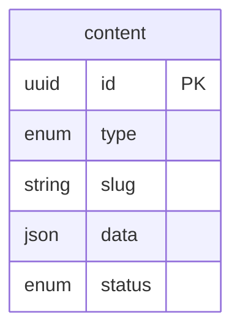

# ADR 007: Content Model Flexibility

## Status

<Badge type="tip" text="Accepted" />

## Context

The portfolio CMS needs to store diverse content types:
- **Projects**: Title, description, tags, links, images
- **Pages**: Title, markdown content
- **Lists**: Skills, experience, education (each with different structures)
- **Config**: Site settings, social links

Design tension:
- **Schema rigidity**: Strong typing prevents errors, enables validation
- **Schema flexibility**: Easier to evolve, add new content types, customize

A portfolio is personal - different users want different structures. The content model must balance type safety with flexibility.

## Decision

Use a **hybrid approach**:
1. Fixed schema for metadata columns (`id`, `type`, `slug`, `status`, `version`)
2. Flexible JSON `data` column for content-specific fields
3. Runtime validation via Zod schemas per content type
4. No database-level JSON schema enforcement

| id | type | slug | data | status |
|----|------|------|------|--------|
| uuid-1 | project | app-x | `{title:...}` | published |
| uuid-2 | about | about | `{title:..., content:...}` | published |
| uuid-3 | skill | typescript | `{name:..., category:...}` | draft |
| uuid-4 | contact | contact | `{name:..., email:...}` | published |

## Alternatives Considered

| Approach | Pros | Cons |
|----------|------|------|
| **Separate tables per type** | Strong typing, referential integrity | Schema changes require migrations, rigid |
| **EAV (Entity-Attribute-Value)** | Maximum flexibility | Query nightmare, no type safety |
| **JSON column (unvalidated)** | Maximum flexibility, simple | No validation, inconsistent data |
| **JSON column (app-validated)** | Flexibility + validation at API boundary | Validation not enforced at DB level |
| **Document database** | Native JSON, flexible schemas | Different tech stack, overkill |

## Rationale

### Why Not Separate Tables?

For a portfolio with 4 content types and ~100 items total, separate tables create:
- 4x more migration files
- 4x more repository methods
- Rigid schema that requires migrations to change

The marginal type safety doesn't justify the overhead.

### Why Not Pure Schemaless?

Unvalidated JSON leads to:
- Inconsistent data shapes
- Runtime errors in frontend
- Hard to debug issues

### Why App-Level Validation?

Zod schemas at the API boundary provide:
- TypeScript inference for handlers
- Detailed error messages
- Easy to update (no migration)
- Can vary by context (admin vs public)

## Validation Strategy

### On Write (Admin API)

Validation happens at API boundary using Zod schemas:
1. Validate base structure (`type`, `slug`, `status`)
2. Resolve type-specific schema based on `type` and `slug`
3. Validate `data` field against type-specific schema
4. Store with validated data

### On Read (Public API)

No validation on read - trust what's in the database. If invalid data exists, it's a bug to fix, not a user error.

### Migration Path

To add a new field to projects:
1. Update `ProjectDataSchema` in code
2. Deploy
3. New content gets validated
4. Old content works (optional fields) or needs backfill

No database migration required.

## Consequences

### Positive

- **Flexibility**: Add/change fields without migrations
- **Type safety**: Zod provides TypeScript types
- **Clear validation errors**: Zod's error messages are detailed
- **Simple queries**: Single table for all content
- **Easy to extend**: Add new content types in code only
- **Version friendly**: JSON changes don't require schema versioning

### Negative

- **No DB-level integrity**: Invalid JSON could be inserted directly to DB
- **Query limitations**: Can't index JSON fields efficiently (SQLite/libSQL)
- **No foreign keys in data**: References between content items are strings
- **Serialization overhead**: JSON parse/stringify on every read/write

### Mitigations

- **Admin-only writes**: Only validated API can write
- **Read-time coercion**: Parse dates, numbers on read
- **Application-level joins**: Fetch related content in service layer
- **Indexing metadata**: Index `type`, `slug`, `status` columns (not JSON)

## Future Considerations

If we need:
- **Full-text search**: Add search index (MeiliSearch, Algolia)
- **Complex queries on data**: Consider extracting to indexed columns
- **Strict type enforcement**: Add database CHECK constraints or triggers
- **Multi-tenant**: Add tenant_id column, keep JSON structure

## References

- [PostgreSQL JSON Best Practices](https://www.postgresql.org/docs/current/datatype-json.html) (concepts apply to SQLite JSON1)
- [Zod Documentation](https://zod.dev/)
- [Headless CMS Data Modeling](https://www.contentful.com/help/content-modelling-basics/)
