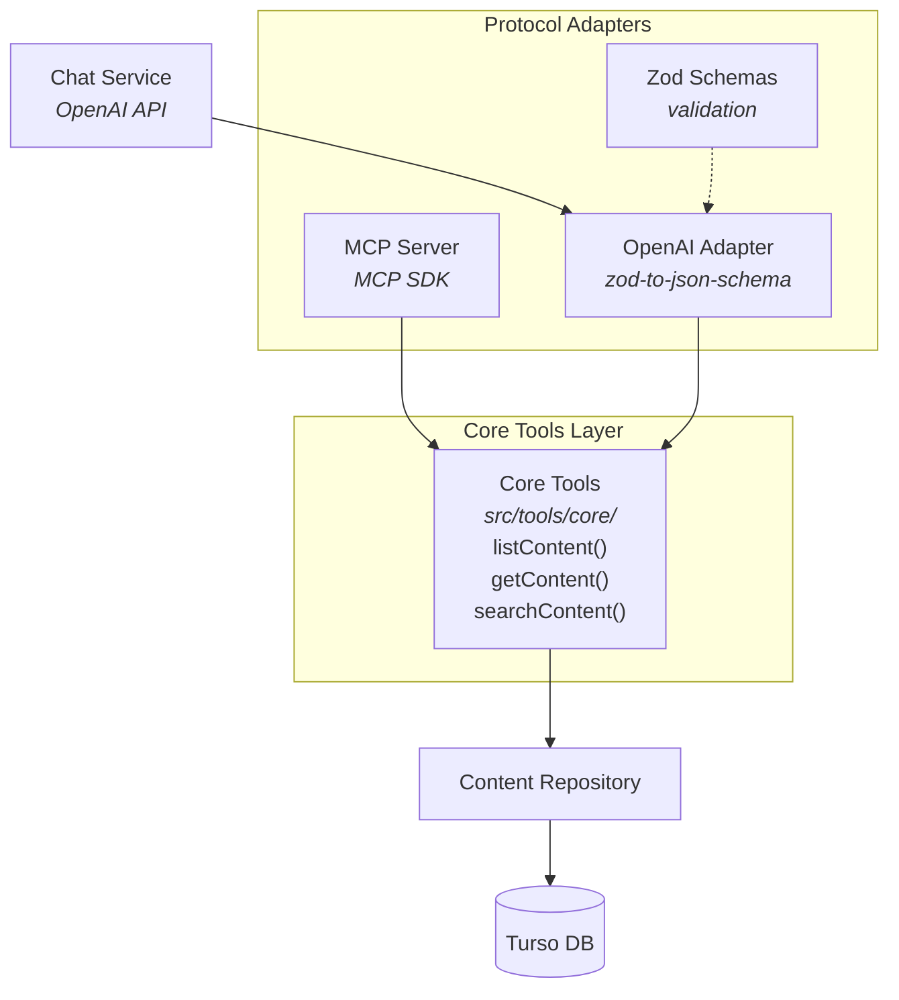

# ADR 008: Shared Tools Architecture

## Status

<Badge type="tip" text="Accepted" />

## Context

The portfolio backend exposes tools for querying portfolio data through two interfaces:

1. **MCP Server**: Used by AI assistants like Claude Desktop to query portfolio content
2. **Chat Service**: Uses OpenAI function calling to let the LLM query data during conversations

Initially, each interface had its own tool implementations, leading to:
- Duplicated business logic for querying content
- Potential inconsistencies between MCP and chat responses
- Higher maintenance burden when updating tool behavior
- Different validation and error handling approaches

Both interfaces need the same core functionality:
- `list_content`: List portfolio items by type
- `get_content`: Get a specific item by type and slug
- `search_content`: Search content by keywords

## Decision

Extract shared tool logic into a core tools layer (`src/tools/core/`) that both MCP and OpenAI adapters consume. Each adapter handles protocol-specific concerns while delegating to the same core functions.

### Architecture



### File Structure

```
src/tools/
  types.ts              # ToolResult<T>, ContentItem types
  index.ts              # Re-exports for external use
  core/
    index.ts            # Re-exports core functions
    list-content.ts     # listContent() implementation
    get-content.ts      # getContent() implementation
    search-content.ts   # searchContent() implementation
  openai-adapter.ts     # chatToolDefinitions, executeToolCall()
```

## Alternatives Considered

| Option | Pros | Cons |
|--------|------|------|
| **Duplicate code in each adapter** | Simple, no abstraction | Maintenance burden, inconsistencies |
| **MCP tools call REST API** | HTTP-based, protocol agnostic | Network overhead, circular dependency |
| **OpenAI adapter calls MCP server** | Reuse MCP implementation | MCP SDK overhead, format conversion |
| **Shared core functions (chosen)** | Single source of truth, minimal overhead | Requires abstraction layer |

## Consequences

### Positive

- **Consistency**: Both MCP and chat return identical data for the same queries
- **Maintainability**: Update logic once, affects both interfaces
- **Type safety**: Shared TypeScript types ensure compile-time correctness
- **Testability**: Core functions can be unit tested independently
- **Schema reuse**: Zod schemas used for both validation and JSON Schema generation

### Negative

- **Abstraction overhead**: Additional layer between adapters and repository
- **Coupling**: Changes to core functions affect both interfaces
- **Schema conversion**: Need `zod-to-json-schema` for OpenAI format

### Mitigations

- **Minimal abstraction**: Core functions are thin wrappers around repository
- **Semantic versioning**: Breaking changes documented in ADRs
- **Type guards**: Runtime validation ensures correct data shapes

## Implementation Details

### Core Tool Function

```typescript
// src/tools/core/list-content.ts
export async function listContent(
  input: ListContentInput
): Promise<ToolResult<ListContentResult>> {
  const params = ListContentInputSchema.parse(input)

  const items = await contentRepository.findAll({
    type: params.type,
    status: params.status,
    limit: params.limit,
  })

  return {
    success: true,
    data: { items: results },
  }
}
```

### MCP Adapter

```typescript
// src/mcp/tools/list-content.ts
import { listContent } from '@/tools/core'

export function registerListContent(server: McpServer) {
  server.tool(
    'list_content',
    'List content items by type',
    ListContentInputSchema.shape,
    async (input) => {
      const result = await listContent(input)
      return {
        content: [{
          type: 'text',
          text: JSON.stringify(result.data?.items ?? [], null, 2),
        }],
      }
    }
  )
}
```

### OpenAI Adapter

```typescript
// src/tools/openai-adapter.ts
import { zodToJsonSchema } from 'zod-to-json-schema'
import { listContent, getContent, searchContent } from './core'

export const chatToolDefinitions: FunctionDefinition[] = [
  {
    name: 'list_content',
    description: 'List portfolio content items by type...',
    parameters: zodToJsonSchema(ListContentInputSchema),
  },
  // ... other tools
]

export async function executeToolCall(toolCall: ToolCall): Promise<string> {
  const { name, arguments: argsString } = toolCall.function
  const args = JSON.parse(argsString)

  switch (name) {
    case 'list_content':
      return JSON.stringify(await listContent(args))
    // ... other cases
  }
}
```

## References

- [OpenAI Function Calling](https://platform.openai.com/docs/guides/function-calling)
- [Model Context Protocol](https://modelcontextprotocol.io/)
- [zod-to-json-schema](https://github.com/StefanTerdell/zod-to-json-schema)
