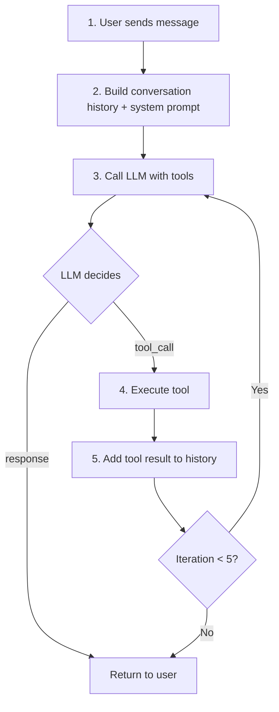
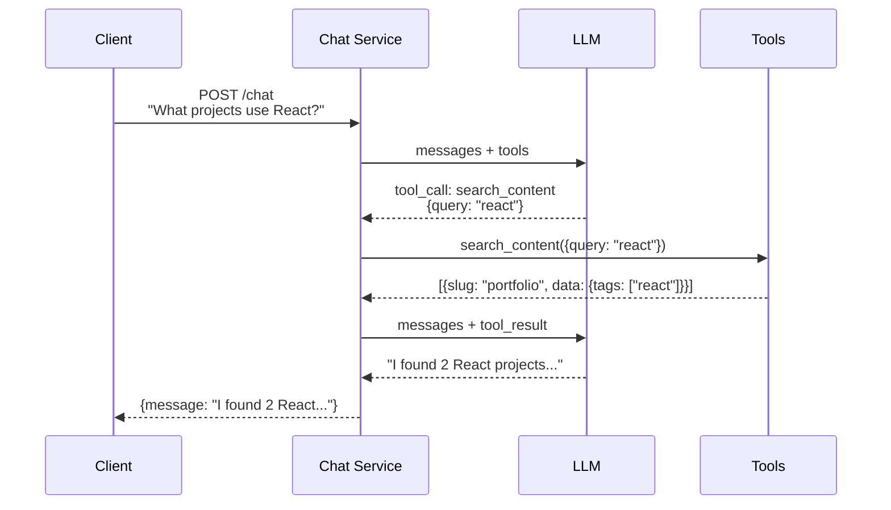

# Chat Tools Integration

## Overview

The chat service uses **OpenAI function calling** to give the AI assistant access to portfolio data. When a visitor asks about projects, skills, or experience, the LLM can call tools to query accurate, up-to-date information from the database.

```mermaid
flowchart LR
    Client([Client]) --> ChatSvc[Chat Service]
    ChatSvc --> LLM[LLM<br/>(OpenAI)]
    LLM -->|tool_call| Tools[Tools]
    Tools -->|query| Repo[Content Repo]

    LLM -->|tool_call| Loop[Tool Loop]
    Loop --> Tools
```

## Available Tools

The chat assistant has access to three read-only tools for querying portfolio data:

### `list_content`

List portfolio items by type.

```typescript
// Input
{
  type: 'project' | 'experience' | 'education' | 'skill' | 'about' | 'contact'
  status?: 'draft' | 'published' | 'archived'  // default: 'published'
  limit?: number                                // default: 50, max: 100
}

// Output
{
  success: true,
  data: {
    items: [
      { id, slug, type, data, status, version, sortOrder, createdAt, updatedAt }
    ]
  }
}
```

### `get_content`

Get a specific content item by type and slug.

```typescript
// Input
{
  type: 'project' | 'experience' | 'education' | 'skill' | 'about' | 'contact'
  slug: string
}

// Output
{
  success: true,
  data: {
    item: { id, slug, type, data, status, version, sortOrder, createdAt, updatedAt }
  }
}
```

### `search_content`

Search content by keywords across all text fields.

```typescript
// Input
{
  query: string                                  // Search terms
  type?: 'project' | 'experience' | 'education' | 'skill' | 'about' | 'contact'
  limit?: number                                 // default: 10, max: 50
}

// Output
{
  success: true,
  data: {
    items: [
      { id, slug, type, data, status }
    ]
  }
}
```

## Tool Call Flow

The chat service implements an iterative tool loop that allows the LLM to make multiple tool calls before generating a final response:



### Sequence Diagram



## System Prompt

The chat service uses a system prompt that informs the LLM about available tools:

```
You are a helpful assistant for Spencer's portfolio website.
You can answer questions about Spencer's projects, skills, experience, and education.
Be concise, professional, and helpful. If you don't know something, say so.
Do not share any personal information that wasn't explicitly provided to you.

You have access to tools that can query Spencer's portfolio data:
- list_content: List portfolio items by type (project, experience, education, skill, about, contact)
- get_content: Get a specific item by type and slug
- search_content: Search content by keywords

Use these tools to provide accurate, up-to-date information about Spencer's background.
```

## Configuration

### Environment Variables

| Variable | Description | Default |
|----------|-------------|---------|
| `LLM_API_KEY` | LLM provider API key | Required |
| `LLM_MODEL` | Model to use | `gpt-4o-mini` |
| `LLM_MAX_TOKENS` | Maximum response tokens | `500` |
| `LLM_TEMPERATURE` | Response temperature | `0.7` |

### Constants

| Constant | Value | Description |
|----------|-------|-------------|
| `MAX_TOOL_ITERATIONS` | 5 | Maximum tool call rounds per request |

## Example Conversations

### Listing Projects

```
User: "What projects do you have?"

[LLM calls list_content({ type: "project" })]
[Tool returns: 3 projects with titles, descriptions, tags]
AI: "Based on my search of the portfolio, I found 3 projects:

1. **Portfolio Backend** - A TypeScript/Express API with content management...
2. **Task Manager CLI** - A command-line task manager...
3. **React Dashboard** - An admin dashboard...

Would you like more details about any of these?"
```

### Searching by Technology

```
User: "Do you have experience with TypeScript?"

[LLM calls search_content({ query: "typescript" })]
[Tool returns: projects and skills matching typescript]

AI: "Yes! TypeScript is used extensively in this portfolio:

- **Projects**: Portfolio Backend, Task Manager CLI both use TypeScript
- **Skills**: TypeScript is listed as a primary language skill

Would you like to know more about how TypeScript is used in these projects?"
```

### Getting Specific Details

```
User: "Tell me about the portfolio backend project"

[LLM calls get_content({ type: "project", slug: "portfolio-backend" })]
[Tool returns: full project details]

AI: "The Portfolio Backend is a TypeScript/Express API that includes:

- Content management system for portfolio items
- AI-powered chat with OpenAI integration
- MCP server for AI tool integration
- Rate limiting and PII obfuscation

Technologies: TypeScript, Express, Drizzle ORM, Turso, Redis"
```

## Shared Tools Architecture

The chat tools share the same core implementation as the [MCP Server](/integrations/mcp-server). This ensures:

- **Consistency**: Both interfaces return identical data
- **Maintainability**: Single source of truth for tool logic
- **Type safety**: Shared Zod schemas for validation

See [ADR-008: Shared Tools Architecture](/decisions/008-shared-tools-architecture) for details.

## Related Documentation

- [MCP Server Integration](/integrations/mcp-server) - For AI assistant integration
- [ADR-008: Shared Tools](/decisions/008-shared-tools-architecture) - Architecture decision
- [High-Level Design](/architecture/high-level-design) - System architecture
