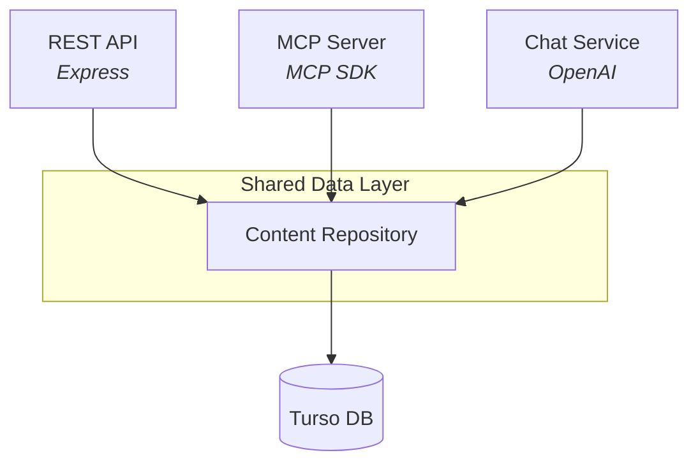

# Integrations Overview

The Portfolio Backend provides multiple integration points for different use cases.

## Integration Options

| Integration | Description | Use Case |
|-------------|-------------|----------|
| [MCP Server & AI Tools](/integrations/mcp-server) | Model Context Protocol + Chat tools | AI assistants (Claude, etc.) and chat |
| [Frontend](/integrations/frontend) | REST API client | Web applications |

## MCP Server & AI Tools

The MCP server enables AI assistants like Claude Desktop to interact with portfolio content directly. The same read tools power the chat endpoint via OpenAI function calling.

**Quick Setup:**

```json
{
  "mcpServers": {
    "portfolio": {
      "command": "bun",
      "args": ["run", "mcp"],
      "cwd": "/path/to/portfolio-backend"
    }
  }
}
```

[Learn more about MCP and AI tools integration](/integrations/mcp-server)

## Frontend Integration

The REST API provides everything needed for frontend applications:

- Content bundle endpoint for fast initial load
- Individual content endpoints with caching
- AI chat integration
- ETag support for efficient caching

[Learn more about frontend integration](/integrations/frontend)

## Architecture

All integrations share the same data layer:


