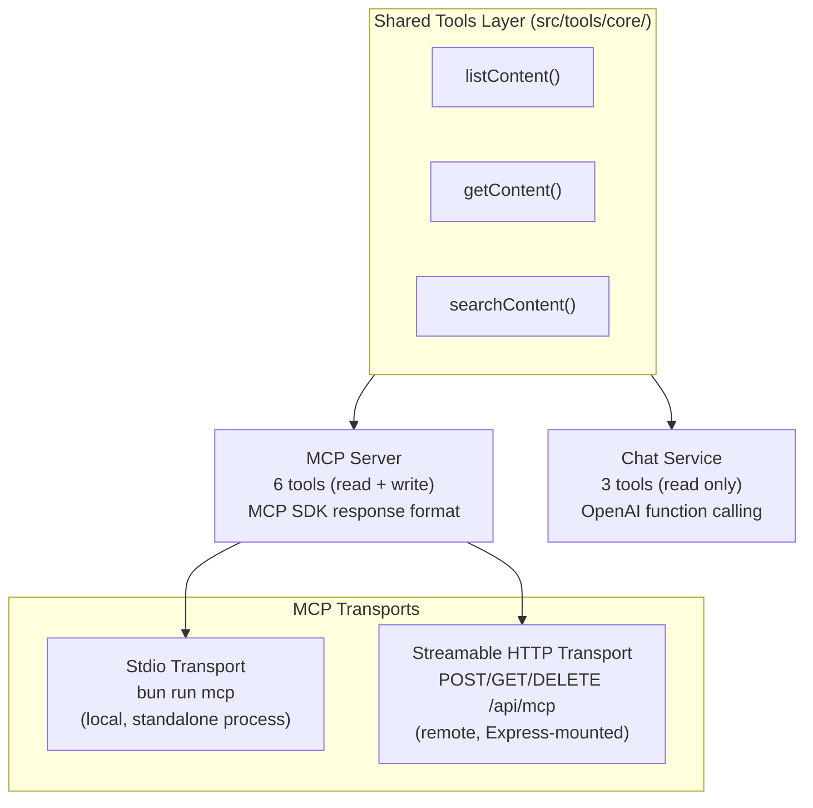
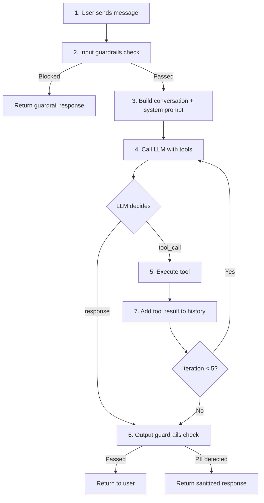
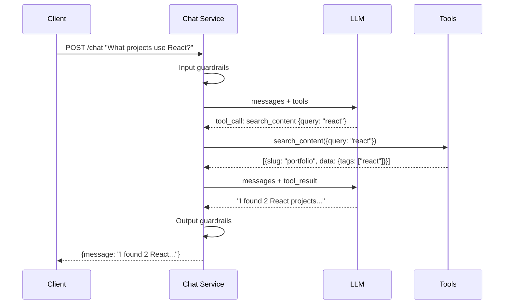
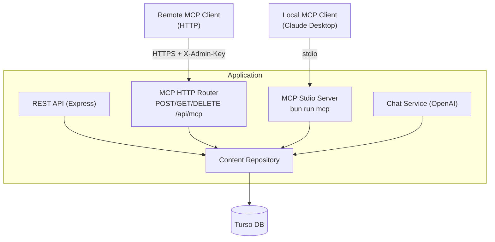

# MCP Server & AI Tools

## Overview

The portfolio backend provides AI tools through two interfaces:

1. **MCP Server** -- a [Model Context Protocol](https://modelcontextprotocol.io/) server for AI assistants like Claude Desktop. Supports 6 tools (read + write) via **two transports**: stdio (local) and Streamable HTTP (remote).
2. **Chat Service** -- an OpenAI function-calling integration that gives the chat endpoint access to the 3 read-only tools.

Both share the same core tool implementations in `src/tools/core/`, ensuring consistent behavior.



## Transports

The MCP server is available over two transports. Both expose the same tools, resources, and prompts.

### Stdio (Local)

The stdio transport runs the MCP server as a standalone child process. This is the standard approach for local AI assistants like Claude Desktop.

- Start with: `bun run mcp`
- Communication over stdin/stdout using JSON-RPC
- Requires database environment variables to be set in the process

### Streamable HTTP (Remote)

The Streamable HTTP transport mounts the MCP server on the Express application at `/api/mcp`, protected by admin authentication.

- **Endpoint**: `POST/GET/DELETE /api/mcp`
- **Auth**: Requires `X-Admin-Key` header (same as other admin endpoints)
- **Sessions**: Stateful sessions managed via the `mcp-session-id` response/request header
- **Protocol**:
  - `POST /api/mcp` -- Send JSON-RPC requests (initialize, tool calls, etc.)
  - `GET /api/mcp` -- Open SSE stream for server-initiated notifications
  - `DELETE /api/mcp` -- Terminate an MCP session

This transport enables remote MCP clients, CI/CD integrations, and any HTTP-capable tool to interact with the MCP server without spawning a local process.

## Content Types

All tools operate on the unified content model:

| Type | Description |
|------|-------------|
| `project` | Portfolio projects with title, description, tags, links |
| `experience` | Work experience history |
| `education` | Educational background |
| `skill` | Skills grouped by category |
| `about` | About page content |
| `contact` | Contact information and social links |

See [Content Model Reference](/architecture/content-model) for detailed data schemas.

---

## Shared Read Tools

These 3 tools are available in both the MCP server and the chat service.

### `list_content`

List content items by type with optional status filter.

```typescript
interface ListContentInput {
  type: 'project' | 'experience' | 'education' | 'skill' | 'about' | 'contact'
  status?: 'draft' | 'published' | 'archived'  // default: 'published'
  limit?: number                                // default: 50, max: 100
}

interface ListContentOutput {
  items: Array<{
    id: string
    slug: string
    type: string
    data: Record<string, unknown>
    status: string
    version: number
    sortOrder: number
    createdAt: string
    updatedAt: string
  }>
}
```

**Example invocation:**
```
User: "Show me all published projects"
AI calls: list_content({ type: "project", status: "published" })
```

### `get_content`

Get a single content item by type and slug.

```typescript
interface GetContentInput {
  type: 'project' | 'experience' | 'education' | 'skill' | 'about' | 'contact'
  slug: string
}

interface GetContentOutput {
  id: string
  slug: string
  type: string
  data: Record<string, unknown>
  status: string
  version: number
  sortOrder: number
  createdAt: string
  updatedAt: string
}
```

**Example invocation:**
```
User: "Tell me about the portfolio-backend project"
AI calls: get_content({ type: "project", slug: "portfolio-backend" })
```

### `search_content`

Search content by query across title, description, name, and other text fields.

```typescript
interface SearchContentInput {
  query: string                                  // Search query
  type?: 'project' | 'experience' | 'education' | 'skill' | 'about' | 'contact'
  limit?: number                                 // default: 10, max: 50
}

interface SearchContentOutput {
  items: Array<{
    id: string
    slug: string
    type: string
    data: Record<string, unknown>
    status: string
  }>
}
```

**Example invocation:**
```
User: "What projects use TypeScript?"
AI calls: search_content({ query: "typescript", type: "project" })
```

---

## MCP-Only Write Tools

These tools are only available through the MCP server (not in chat).

### `create_content`

Create new content with type-specific data validation.

```typescript
interface CreateContentInput {
  type: 'project' | 'experience' | 'education' | 'skill' | 'about' | 'contact'
  slug?: string                                  // Auto-generated from title/name if not provided
  data: Record<string, unknown>                  // Must match type-specific schema
  status?: 'draft' | 'published' | 'archived'   // default: 'draft'
  sortOrder?: number                             // default: 0
}
```

### `update_content`

Update existing content with version history tracking.

```typescript
interface UpdateContentInput {
  id: string                                     // Content ID to update
  slug?: string
  data?: Record<string, unknown>
  status?: 'draft' | 'published' | 'archived'
  sortOrder?: number
}
```

### `delete_content`

Soft delete content (can be restored later).

```typescript
interface DeleteContentInput {
  id: string                                     // Content ID to delete
}
```

---

## MCP Resources

Resources are URIs that AI can read to get content. Unlike tools, resources are read-only and follow a URI pattern.

| URI | Description | Returns |
|-----|-------------|---------|
| `portfolio://content` | All published content | JSON array of all content items |
| `portfolio://content/{type}` | Content by type | JSON array of content for specified type |
| `portfolio://content/{type}/{slug}` | Single content item | Full content item JSON |

**Supported types in URI:**
- `portfolio://content/project`
- `portfolio://content/experience`
- `portfolio://content/education`
- `portfolio://content/skill`
- `portfolio://content/about`
- `portfolio://content/contact`

## MCP Prompts

Pre-defined prompt templates for common use cases.

### `summarize_portfolio`

Generate a summary of the entire portfolio suitable for a specific audience.

```typescript
interface SummarizePortfolioInput {
  audience: 'recruiter' | 'technical' | 'general'
}
```

### `explain_project`

Explain a project's technical decisions and architecture.

```typescript
interface ExplainProjectInput {
  slug: string
  depth: 'overview' | 'detailed' | 'deep-dive'
}
```

### `compare_skills`

Compare the portfolio owner's skills to a job requirement.

```typescript
interface CompareSkillsInput {
  requiredSkills: string[]
  niceToHave?: string[]
}
```

---

## Chat Integration

The chat service (`POST /api/v1/chat`) uses OpenAI function calling to give the AI assistant access to the same 3 read tools. The chat service also includes:

- **Input guardrails** -- validates and sanitizes user messages before sending to the LLM
- **Output guardrails** -- checks LLM responses for PII leakage before returning to the user
- **PII sanitization** -- LLM responses are checked for PII and redacted before returning to the user

### Tool Call Flow



### Sequence Diagram



### Constants

| Constant | Value | Description |
|----------|-------|-------------|
| `MAX_TOOL_ITERATIONS` | 5 | Maximum tool call rounds per request |

---

## Configuration

### Claude Desktop Setup (Stdio)

Add to `~/Library/Application Support/Claude/claude_desktop_config.json`:

```json
{
  "mcpServers": {
    "portfolio": {
      "command": "bun",
      "args": ["run", "mcp"],
      "cwd": "/path/to/portfolio-backend",
      "env": {
        "TURSO_DATABASE_URL": "libsql://...",
        "TURSO_AUTH_TOKEN": "..."
      }
    }
  }
}
```

Restart Claude Desktop to activate the integration.

### Remote HTTP Setup

For remote MCP clients that support HTTP transport, point them at the deployed server:

```json
{
  "mcpServers": {
    "portfolio": {
      "url": "https://your-domain.com/api/mcp",
      "headers": {
        "X-Admin-Key": "your-admin-api-key"
      }
    }
  }
}
```

**Testing with curl:**

```bash
# Initialize a new MCP session
curl -X POST https://your-domain.com/api/mcp \
  -H "Content-Type: application/json" \
  -H "X-Admin-Key: your-admin-api-key" \
  -d '{
    "jsonrpc": "2.0",
    "id": 1,
    "method": "initialize",
    "params": {
      "protocolVersion": "2025-03-26",
      "capabilities": {},
      "clientInfo": { "name": "curl-test", "version": "1.0.0" }
    }
  }'
# The response includes a mcp-session-id header for subsequent requests
```

### Environment Variables

The MCP server requires the same database environment variables as the main application:

| Variable | Description | Required |
|----------|-------------|----------|
| `TURSO_DATABASE_URL` | Database connection | Yes |
| `TURSO_AUTH_TOKEN` | Database auth | Yes |
| `ADMIN_API_KEY` | For write operations (min 32 chars) | Yes |
| `LLM_API_KEY` | LLM provider API key | Yes |

## Shared Architecture

The MCP server shares the same data layer as the REST API, regardless of transport:



This ensures consistent data access, shared validation schemas, and version history tracking across both transports.

**Schema conversion** for OpenAI function calling:

```typescript
// Zod schemas are converted to JSON Schema for OpenAI via zod-to-json-schema
import { zodToJsonSchema } from 'zod-to-json-schema'
const jsonSchema = zodToJsonSchema(ListContentInputSchema)
```

See [ADR-008: Shared Tools Architecture](/decisions/008-shared-tools-architecture) for the full decision record.

## Error Handling

MCP errors follow the protocol specification:

| Code | Meaning |
|------|---------|
| -32600 | Invalid request |
| -32601 | Method not found |
| -32602 | Invalid params |
| -32603 | Internal error |
| -32001 | Resource not found |
| -32002 | Validation failed |

## Example Session

```
Human: What TypeScript projects does this portfolio have?

[Claude calls search_content({ query: "typescript", type: "project" })]

Claude: Based on the portfolio, there are 3 TypeScript projects:

1. **Portfolio Backend** - A full-featured Express API with content management...
2. **Task Manager CLI** - A command-line task manager with local SQLite...
3. **React Dashboard** - An admin dashboard using TypeScript and React Query...

Would you like more details about any of these?
```
