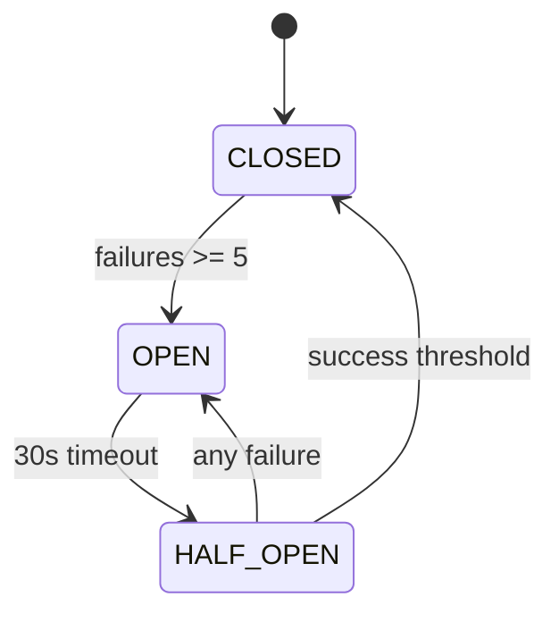

# Operational Runbook

This runbook covers common operational scenarios, troubleshooting procedures, and incident response.

## Health Checks

### Endpoints

| Endpoint | Purpose | Expected Response |
|----------|---------|-------------------|
| `GET /api/health` | Quick health check | `{ status: 'ok' }` |
| `GET /api/health/live` | Liveness probe | `{ status: 'ok' }` (200) |
| `GET /api/health/ready` | Readiness probe | `{ status: 'ok', checks: {...} }` |
| `GET /api/health/startup` | Startup probe | `{ status: 'ok' }` |

### Manual Health Check

```bash
# Quick check
curl -s https://api.yoursite.com/api/health | jq

# Detailed readiness (includes DB status)
curl -s https://api.yoursite.com/api/health/ready | jq

# Expected ready response
{
  "status": "ready",
  "checks": {
    "database": "ok"
  }
}

# Degraded response (database issue)
{
  "status": "degraded",
  "checks": {
    "database": "error"
  }
}
```

### Failure Responses

| Status | Meaning | Action |
|--------|---------|--------|
| 200 + `status: ok` | All systems operational | None |
| 200 + `status: degraded` | Non-critical component down | Monitor, investigate |
| 503 + `status: unhealthy` | Critical component down | Immediate investigation |

## Common Issues

### Issue: API Returns 502 on Chat Endpoint

**Symptoms:**
- Chat requests return 502 Bad Gateway
- Circuit breaker metrics show open state

**Cause:** LLM provider is unavailable or timing out, circuit breaker opened.

**Resolution:**
1. Check LLM provider status (OpenAI status page, etc.)
2. Wait for circuit breaker to transition to half-open (default: 30 seconds)
3. If persistent, check `LLM_API_KEY` env var
4. See [Circuit Breaker Recovery](#circuit-breaker-recovery)

### Issue: API Returns 429 Too Many Requests

**Symptoms:**
- Requests return 429 with `Retry-After` header
- Affects specific IPs or all traffic

**Cause:** Rate limiter triggered.

**Resolution:**
1. Check if legitimate traffic spike or attack
2. For legitimate users, wait for `Retry-After` duration
3. If attack, consider blocking IP at reverse proxy level
4. See [Rate Limiting](#rate-limiting) for tuning

### Issue: Content Not Updating After Admin Changes

**Symptoms:**
- Admin updates content via API
- Public endpoint returns stale data

**Cause:** Cache not invalidated properly.

**Resolution:**
```bash
# Check database status
curl -s https://api.yoursite.com/api/health/ready | jq '.checks.database'

# If using Redis, manually clear cache (emergency only)
redis-cli -u $REDIS_URL FLUSHDB

# Or restart the application to clear in-memory cache
```

### Issue: Database Connection Errors

**Symptoms:**
- 500 errors with "database connection" in logs
- `/api/health/ready` shows `checks.database: "error"`

**Cause:** Turso connection issues.

**Resolution:**
1. Check Turso dashboard for outages
2. Verify `TURSO_DATABASE_URL` and `TURSO_AUTH_TOKEN`
3. Test connection:
   ```bash
   turso db shell <your-db-name> "SELECT 1"
   ```
4. Check if auth token expired (tokens expire after 7 days by default)
5. Regenerate token if needed:
   ```bash
   turso db tokens create <your-db-name>
   ```

## Circuit Breaker Recovery

### Understanding States



### Checking Circuit Breaker State

```bash
# Via metrics
curl -s https://api.yoursite.com/api/metrics | grep circuit_breaker
# circuit_breaker_state{name="llm"} 0  # 0=closed, 1=half_open, 2=open
```

### Manual Recovery

The circuit breaker automatically recovers after `resetTimeout` (30 seconds). Manual intervention is rarely needed.

**If stuck open:**

1. Check LLM provider is actually available
2. Restart application (resets circuit breaker)
3. Temporarily increase `failureThreshold` in config

## Database Operations

### Backup (Manual)

Turso handles automated backups, but for manual export:

```bash
# Export to local SQLite file
turso db shell <your-db-name> ".dump" > backup-$(date +%Y%m%d).sql

# Or use Turso's built-in backup
turso db backup <your-db-name>
```

### Restore from Backup

```bash
# Create new database from backup
turso db create restored-db --from-dump backup.sql

# Update TURSO_DATABASE_URL to point to restored-db
# Redeploy application
```

### Schema Migrations

```bash
# Generate migration from schema changes
bun run db:generate

# Apply migrations (development)
bun run db:migrate

# Apply migrations (production)
bun run db:migrate:prod
```

## Cache Management

### Check Cache Status

```bash
# Redis CLI (if using Redis)
redis-cli -u $REDIS_URL INFO memory
redis-cli -u $REDIS_URL DBSIZE
```

### Clear Specific Cache Keys

```bash
# Clear all content cache
redis-cli -u $REDIS_URL KEYS "content:*" | xargs redis-cli -u $REDIS_URL DEL

# Clear rate limit data (careful - resets all limits)
redis-cli -u $REDIS_URL KEYS "ratelimit:*" | xargs redis-cli -u $REDIS_URL DEL

# Clear session cache
redis-cli -u $REDIS_URL KEYS "session:*" | xargs redis-cli -u $REDIS_URL DEL
```

### Switch to Memory Cache (Emergency)

If Redis is unavailable:

1. Unset `REDIS_URL` environment variable
2. Restart application
3. App will fall back to in-memory cache

::: warning
In-memory cache is not shared between instances
:::

## Rate Limiting

### Current Configuration

| Parameter | Default | Description |
|-----------|---------|-------------|
| `RATE_LIMIT_CAPACITY` | 5 | Max burst size (tokens) |
| `RATE_LIMIT_REFILL_RATE` | 0.333 | Tokens per second (1 per 3 seconds) |

### Adjusting Limits

**Temporarily increase limits (via env vars):**

```bash
# Double the capacity
export RATE_LIMIT_CAPACITY=10

# Faster refill
export RATE_LIMIT_REFILL_RATE=1.0

# Restart application
```

### View Rate Limit Metrics

```bash
# Prometheus metrics
curl -s https://api.yoursite.com/api/metrics | grep rate_limit

# rate_limit_hits_total 42
# rate_limit_remaining{ip_hash="..."} 3
```


## Deployment & Rollback

### Deployment Checklist

1. [ ] All tests pass (`bun test`)
2. [ ] Build succeeds (`bun run build`)
3. [ ] Migrations are backwards compatible
4. [ ] Environment variables are set
5. [ ] Health check endpoint responds

### Zero-Downtime Deployment

```bash
# 1. Build new image
docker build -t portfolio-api:new .

# 2. Start new container on different port
docker run -d --name api-new -p 3001:3000 portfolio-api:new

# 3. Wait for health check
until curl -s http://localhost:3001/api/health | grep -q "ok"; do
  sleep 1
done

# 4. Update reverse proxy to point to new container
# (depends on your proxy setup)

# 5. Stop old container
docker stop api-old && docker rm api-old

# 6. Rename new container
docker rename api-new portfolio-api
```

### Rollback Procedure

**Immediate rollback (< 5 min after deploy):**

```bash
# If using Docker
docker stop portfolio-api
docker run -d --name portfolio-api -p 3000:3000 portfolio-api:previous

# If using Fly.io
fly releases -a portfolio-api
fly deploy --image registry.fly.io/portfolio-api:v123
```

**Database rollback (if migration broke something):**

```bash
# Generate rollback migration
bun run db:generate -- --name rollback_xyz

# Or restore from backup (see Database Operations)
```

## Monitoring Alerts

### Critical Alerts (Page Immediately)

| Alert | Threshold | Meaning |
|-------|-----------|---------|
| `http_errors_5xx_rate` | > 10/min | Server errors spiking |
| `health_check_failed` | 3 consecutive | Application unhealthy |
| `circuit_breaker_state` | = 2 (open) | LLM unavailable |
| `database_connection_errors` | > 0 | DB connectivity issues |

### Warning Alerts (Investigate During Business Hours)

| Alert | Threshold | Meaning |
|-------|-----------|---------|
| `rate_limit_hits` | > 100/hour | Possible abuse or load spike |
| `http_latency_p99` | > 1s | Performance degradation |
| `cache_miss_ratio` | > 0.5 | Cache ineffective |
| `llm_latency_p95` | > 10s | LLM slow |

## Security Incidents

### API Key Compromise

If the admin API key is compromised:

1. Generate new key: `openssl rand -base64 32`
2. Update environment variable
3. Redeploy application
4. Audit recent admin actions in logs

### DDoS / Abuse

1. Enable rate limiting at reverse proxy level
2. Block offending IPs
3. Consider enabling CAPTCHA for chat
4. Review rate limit settings

## Quick Commands Reference

```bash
# Health check
curl -s https://api.yoursite.com/api/health/ready | jq

# View logs (Docker)
docker logs portfolio-api --tail 100 -f

# View logs (structured)
docker logs portfolio-api --tail 100 | jq '.level, .context, .message'

# Restart application
docker restart portfolio-api

# Check Prometheus metrics
curl -s https://api.yoursite.com/api/metrics

# Test admin auth
curl -H "X-Admin-Key: $ADMIN_API_KEY" \
  https://api.yoursite.com/api/v1/admin/content

# Clear all caches (emergency)
redis-cli -u $REDIS_URL FLUSHDB

# Database query (Turso)
turso db shell <db-name> "SELECT COUNT(*) FROM content"
```

## Contact & Escalation

| Issue Type | First Response | Escalation |
|------------|----------------|------------|
| Application errors | Check runbook, restart | Review logs, rollback |
| Database issues | Check Turso status | Restore from backup |
| LLM issues | Wait for circuit breaker | Check provider status |
| Security incident | Rotate credentials | Full audit |
